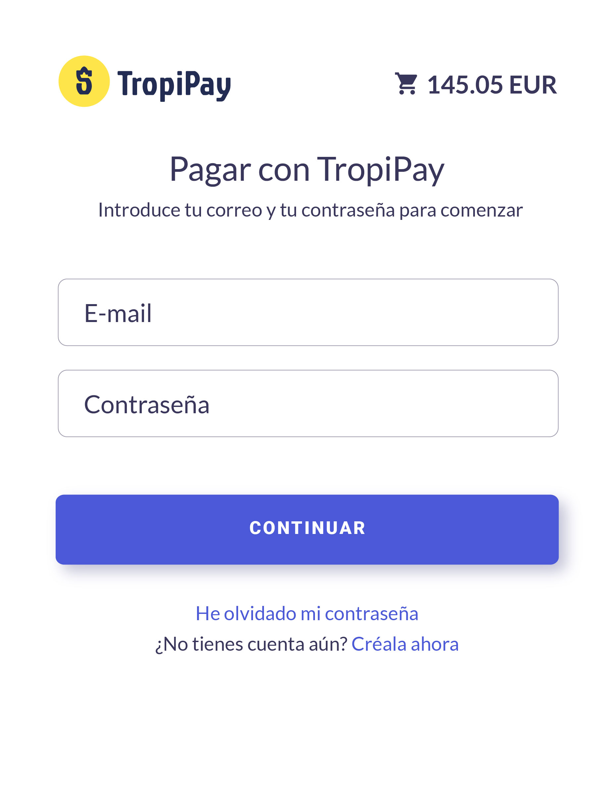
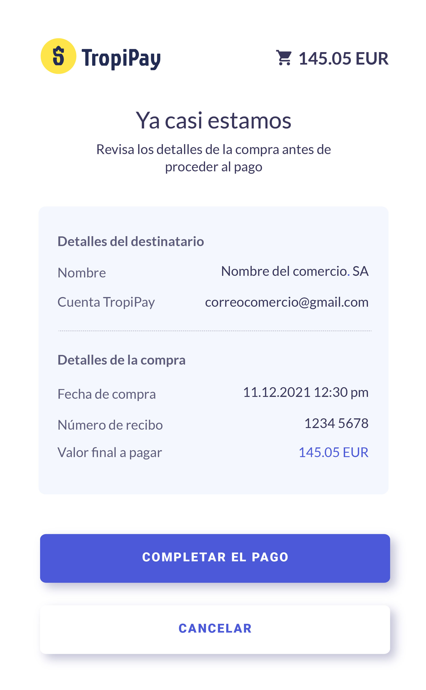
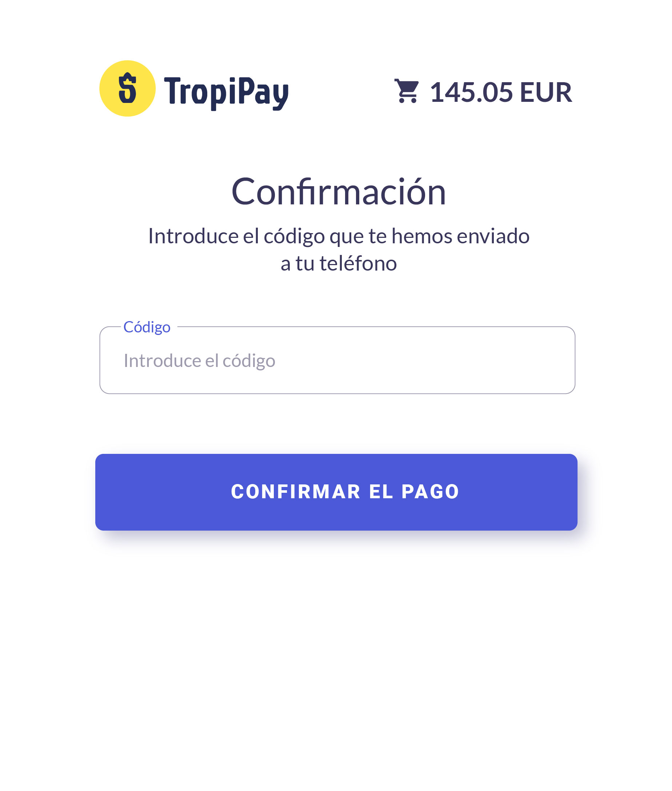
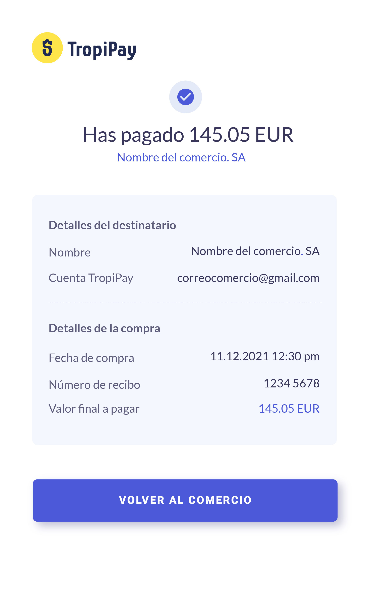

# The Pay-With-Tropipay flow

You can integrate tropipay as a payment gateway in your site. It's as easy as adding a pay-with-tropipay button in the prefered place so your customers can click it. Then, those customers (who already have their own Tropipay account with enough balance) will be redirected to a Tropipay flow to guide them through the payment process. That's it!

<!-- theme: info -->
>#### info
> Don't worry, they will be redirected back to your site once they finish the transaction. Also a callback will be sent to specified ``urlNotification`` URL

If you are a developer making the integration, you will probably need to check [this link about generating payment flow URL](/reference/Tropipay-API.v2.yaml/paths/~1movements~1in~1with_tpp_url/post) in order to generate the url to redirect the customer to.

Once clicked the button, customers will be first presented a login form you they can authenticate with their credentials. 
***

***
After successful login, a small details box will be presented so they can verify purchase details

***

***

Before executing payment, an operation validation code is required so user will either receive a verification code by SMS or be required to type a 2FA verification code to validate the transaction

***

***

Once set the verification code and clicked the confirmation button, a Successful Operation page will be presented to the customer to confirm purchase and redirect her back to your site

***

***